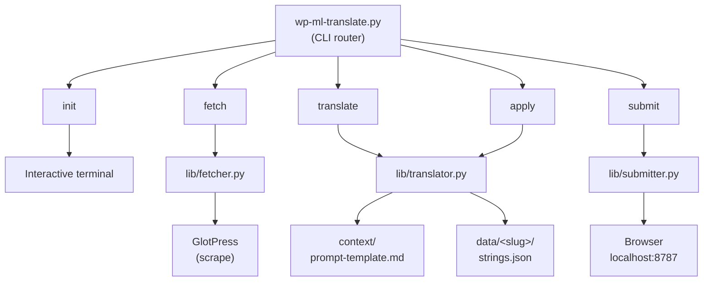
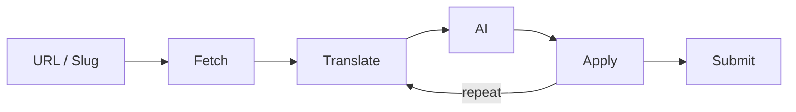
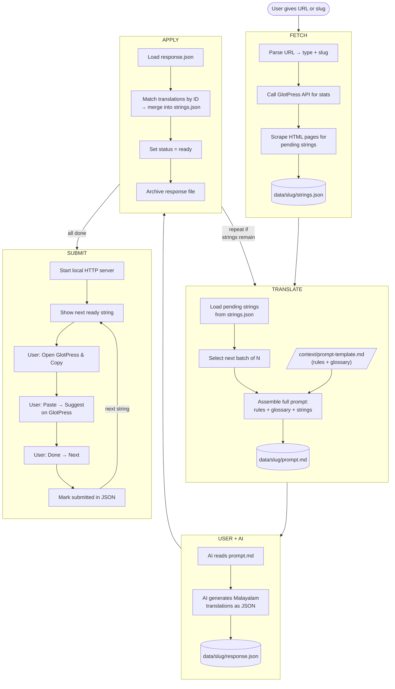
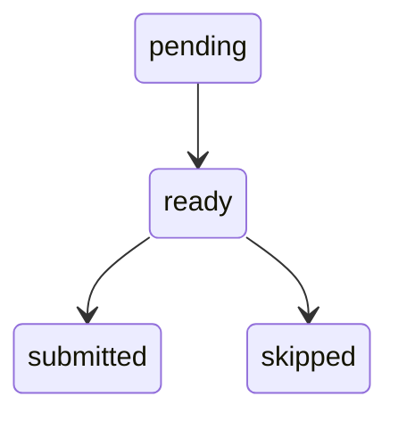

# Architecture — wp-ml-translate

Technical documentation for how the system works internally.

---

## System Design



## Data Flow (Overview)



## Data Flow (Detailed)



## Per-Project Data (`data/<slug>/`)

Each project gets its own folder:

```
data/
├── twentyten/
│   ├── strings.json           # Main data file
│   ├── prompt.md              # Latest generated prompt (gitignored)
│   ├── response.json          # AI output before apply (gitignored)
│   └── response_applied.json  # Archived after apply (gitignored)
├── twentytwentyfour/
│   └── ...
└── woocommerce/
    └── ...
```

### strings.json format

```json
{
  "project": {
    "slug": "twentyten",
    "name": "Twenty Ten",
    "type": "wp-themes",
    "url": "https://translate.wordpress.org/projects/wp-themes/twentyten/ml/default/",
    "fetched_at": "2026-08-07T...",
    "stats": {
      "total": 109,
      "translated": 84,
      "pending": 25,
      "percent": 77
    }
  },
  "strings": [
    {
      "id": "315232",
      "status": "untranslated",
      "priority": "high",
      "context": "",
      "original": "The 2010 theme...",
      "plural": "",
      "references": "style.css:0",
      "comment": "Description of the theme",
      "glossary_hits": {"theme": "തീം", "WordPress": "വേഡ്പ്രസ്സ്"},
      "placeholders": [],
      "translation": "...",
      "translation_status": "ready",
      "submitted": false,
      "permalink": "https://..."
    }
  ]
}
```

### String status lifecycle



## Components

### Fetcher (`lib/fetcher.py`)

- **URL parsing**: Handles full URLs, locale URLs, type/slug paths, bare slugs
- **API**: `/api/projects/<type>/<slug>` for stats
- **Scraping**: HTML table pagination, 15 rows/page, 0.7s delay between requests
- **Extracts**: original text, plural, context, references, comments, glossary hits, placeholders

### Translator (`lib/translator.py`)

- **`generate_prompt()`**: Assembles prompt-template.md + batch of strings → prompt.md
- **`apply_translations()`**: Parses AI JSON response, merges into strings.json, handles code block wrappers

### Submitter (`lib/submitter.py`)

- Embedded single-page HTML app (no external dependencies)
- HTTP server with `/api/state`, `/api/done`, `/api/skip` endpoints
- Saves state to strings.json after every action
- Keyboard shortcuts: O (open+copy), N (done+next), S (skip)

## URL Parsing Logic

```python
Input                                          → (type, slug)
"twentyten"                                    → ("wp-themes", "twentyten")
"wp-plugins/woocommerce"                       → ("wp-plugins", "woocommerce")
".../projects/wp-themes/twentyten/ml/default/" → ("wp-themes", "twentyten")
".../locale/ml/default/wp-themes/twentyten/"   → ("wp-themes", "twentyten")
".../locale/ml/default/wp-themes/?filter=..."  → ERROR (listing page)
```

## Translation Quality

All quality control is in `context/prompt-template.md`:
- Strict rules (no English, natural flow, preserve format)
- Mandatory glossary table
- Style guide per context type
- Good/bad examples
- Format preservation examples
- Common mistakes table

This file is embedded in every generated prompt, ensuring consistent quality regardless of which AI agent does the translation.
