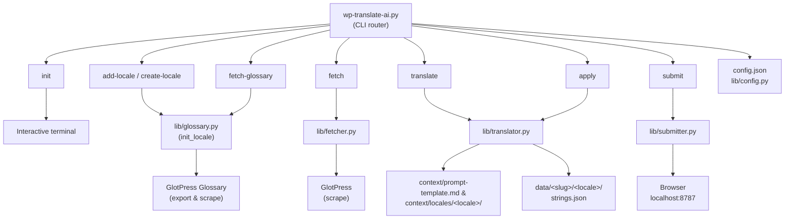
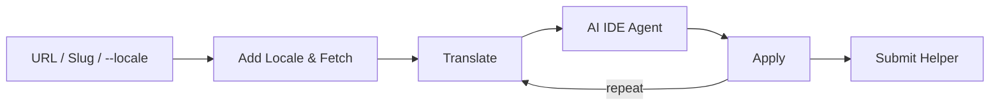
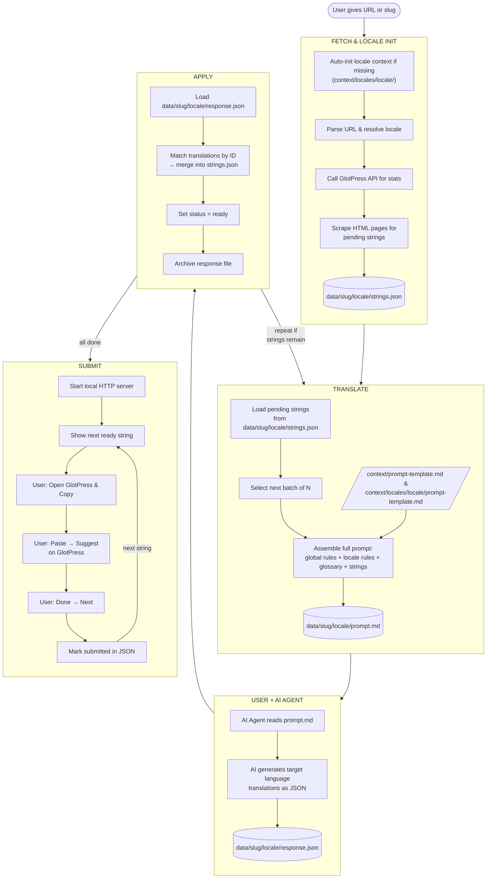

# Architecture — wp-translate-ai

Technical documentation for the internal system design of **`wp-translate-ai`**.

---

## System Design



---

## Data Flow (Overview)



---

## Data Flow (Detailed)



---

## Per-Project Data (`data/<slug>/<locale>/`)

Each project and locale combination gets its own scoped directory:

```text
data/
├── twentyten/
│   ├── ml/
│   │   ├── strings.json           # Main project data for Malayalam
│   │   ├── prompt.md              # Latest generated AI prompt (gitignored)
│   │   ├── response.json          # AI output before apply (gitignored)
│   │   └── response_applied.json  # Archived after apply (gitignored)
│   └── hi/
│       └── strings.json           # Main project data for Hindi
├── gutenberg/
│   └── stable/
│       └── ml/
│           └── strings.json
└── woocommerce/
    └── hi/
        └── strings.json
```

---

## Modular Locale Architecture (`context/locales/`)

Rules and glossaries are decoupled per locale:

```text
context/
├── prompt-template.md         # Global technical & placeholder rules
└── locales/
    ├── ml/
    │   ├── prompt-template.md # Native register & Malayalam style guide
    │   └── glossary.json      # Auto-fetched GlotPress official terms
    └── hi/
        ├── prompt-template.md # Native register & Hindi style guide
        └── glossary.json      # Auto-fetched GlotPress official terms
```

---

## Components

### Configuration (`config.json` & `lib/config.py`)
- Reads global settings (`default_locale`, `default_batch_size`, `user_agent`).
- Resolves CLI `--locale` arguments and fallback values.

### Fetcher (`lib/fetcher.py`)
- Scrapes pending strings from any GlotPress project.
- Automatically discovers nested sub-projects (e.g. `gutenberg/stable`).

### Glossary Manager (`lib/glossary.py`)
- Fetches official GlotPress glossaries for any target locale.
- Stores terms locally as `context/locales/<locale>/glossary.json`.

### Translator (`lib/translator.py`)
- Generates `prompt.md` using the target locale template and official glossary.
- Parses AI response JSON and updates `strings.json`.

### Submitter (`lib/submitter.py`)
- Embedded single-page HTML submit app (zero dependencies).
- Runs HTTP server on `http://localhost:8787`.
- Updates submission progress in `strings.json`.

